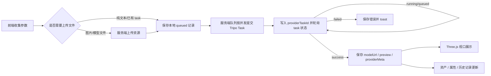

# NexusAI 3D 工作区 Tripo API 点对点映射

> 更新时间：2026-05-05  
> 范围：仅分析 `components/model3d/*` 当前前端入口与 Tripo API 的后续对接关系。  
> 原则：不误动已完成的图片、视频、Agent、历史记录、数据库模块；正式接入前必须再次核对 Tripo 官方 schema 字段。

## 1. 对接目标

本文档用于把 NexusAI 3D 工作区现有前端按钮、选项、状态与 Tripo API 能力逐项对齐，作为后续真实 API 接入的开发清单。

当前 3D 工作区已进入 Tripo API 初步接入阶段；所有真实请求必须经过 `app/api/model3d/*` 服务端路由，前端不持有 API key。

## 0. 官方 Schema 校准结论

本轮已按用户提供的 `OpenAPI Shema.txt` 与官方截图校准字段：

- Base URL：`https://api.tripo3d.com/v2/openapi`
- 创建任务：`POST /task`
- 查询任务：`GET /task/{task_id}`
- 图片直传：`POST /upload`，返回 token 后以 `file: { type, file_token }` 传入任务
- STS 上传：`POST /upload/sts/token`，用于后续私有模型/大文件 OSS 直传，返回 `resource_bucket/resource_uri/sts_ak/sts_sk/session_token`
- 钱包余额：`GET /user/balance`，返回 `balance/frozen`
- 任务返回：`data.task_id`，查询后 `data.output.model/base_model/pbr_model/rendered_image`
- 状态：`queued/running/success/failed/cancelled/unknown/banned/expired`

已修正的真实 task type：

| 前端能力 | 官方 task type |
|---|---|
| 文本生成模型 | `text_to_model` |
| 图片生成模型 | `image_to_model` |
| 多视图生成模型 | `multiview_to_model` |
| 纹理/PBR 生成 | `texture_model` |
| 部件拆分 | `mesh_segmentation` |
| 部件补全 | `mesh_completion` |
| 重拓扑/智能低多边形 | `highpoly_to_lowpoly` |
| 动画绑定前检查 | `animate_prerigcheck` |
| 动画绑定 | `animate_rig` |
| 动画重定向/套动作 | `animate_retarget` |
| 导入模型 | `import_model` |
| 导出/转换模型 | `convert_model` |
| 风格化 | `stylize_model` |

### 默认生成策略

NexusAI 3D 工作区默认提供稳定、通用的模型生成参数，并把更精细的模型、纹理和材质能力交给用户手动开启：

- 默认模型版本：`v2.5-20250123`，不默认使用 P1。
- 默认生成内容：模型 + 标准纹理。
- 默认关闭：图片自动优化、PBR、高清纹理、分部件生成、四边形拓扑、智能低多边形、精细几何质量。
- 标准纹理默认不发送 `texture_quality`，沿用 Tripo 默认标准纹理；只有用户手动选择“高清纹理”时才发送 `texture_quality: "detailed"`。
- `fileName` 仅用于本地下载命名，不作为 Tripo 计费参数发送。

## 2. Tripo 通用任务流



建议抽象层：

```text
lib/model3d/
  config.ts        # TRIPO_API_KEY、endpoint、默认模型版本、超时等
  tripo.ts         # Tripo HTTP client：createTask/getTask/upload
  tasks.ts         # NexusAI 参数 -> Tripo task payload 映射

app/api/model3d/route.ts
app/api/model3d/tasks/[id]/route.ts
app/api/model3d/upload/route.ts
app/api/model3d/export/route.ts
```

## 3. 前端入口与 API 映射总表

| 前端模块/按钮 | 当前前端位置 | Tripo 文档页 | API 能力判断 | 建议 task/能力名 | 关键输入 | 输出/落库 |
|---|---|---|---|---|---|---|
| 模型：文本转 3D | 左侧“模型”里的文本模式 | generation / task / schema | 支持 | text-to-model | prompt、model_version、quality、texture、pbr、topology、face_count | taskId、modelUrl、previewImageUrl、status、providerMeta |
| 模型：图片生成 3D | 左侧“模型”里的单图模式 | upload / upload-sts / generation | 支持 | image-to-model | image token/file id、model_version、quality、texture、pbr、topology、face_count | taskId、modelUrl、previewImageUrl |
| 模型：多视图生成 3D | 左侧“模型”里的前/后/左/右 | upload / generation | 支持 | multiview-to-model | front/back/left/right 图片 token，缺图策略需确认 | taskId、modelUrl、previewImageUrl |
| 模型：批量图片转 3D | 左侧“模型”里的批量模式 | upload / generation / task | 部分支持 | 多个 image-to-model task 队列 | images[]，每张图片独立提交 | 多条 asset/task 记录 |
| 图片自动优化 | 高精度模型选项 | generation / schema | 需确认字段 | image preprocessing / auto optimize | boolean | providerMeta 记录实际参数 |
| 几何精度：标准/超清 | 高精度模型选项 | generation / schema | 支持或部分支持 | quality/model_version 参数 | quality | 任务参数记录 |
| 分部件生成 | 高精度模型选项 | generation / editing/schema | 需确认字段 | generate_parts / segmentation output | boolean | 层级信息或后续 part split task |
| 纹理生成开关 | 模型生成内嵌选项 | generation / post-process | 支持 | textured generation | boolean、texture_quality | textured modelUrl/materials |
| 高清纹理 | 模型/纹理选项 | generation / post-process | 支持或部分支持 | texture quality/upscale | hd/standard | 贴图分辨率记录 |
| PBR 开关 | 模型生成内嵌选项 | generation / post-process | 支持或部分支持 | pbr material | boolean | PBR material channels |
| 拓扑：三角面/四边面 | 高精度模型/重拓扑 | generation / post-process/schema | 部分支持 | topology/retopo | triangle/quad | 模型 mesh 输出 |
| 面数控制 | 高精度/智能网格/重拓扑 | generation / post-process/schema | 支持或部分支持 | face_count / target face count | number/auto | providerMeta + 结果 stats |
| 智能网格 | 模型 profile | generation / post-process | 部分支持 | smart low-poly/image-to-3d variant | topology、face_count | 低面数模型 |
| 部件拆分 | 左侧“部件拆分” | editing / schema | 支持 | `mesh_segmentation` | current taskId/model resource | 父子层级、part model refs |
| 部件补全 | 左侧“部件补全” | editing / schema | 支持 | `mesh_completion` | current taskId、part_names | 新模型或局部更新结果 |
| 重拓扑 | 左侧“重拓扑” | post-process / schema | 支持 | `highpoly_to_lowpoly` | current taskId、quad、face_limit、bake | retopo modelUrl |
| 纹理生成：图片 | 纹理生成子模块 | generation / upload / post-process | 支持 | `texture_model` + `texture_prompt.image` | current model taskId、image token、quality | textured modelUrl |
| 纹理生成：多视图 | 纹理生成子模块 | generation / upload / post-process | 支持 | `texture_model` + `texture_prompt.images` | current model taskId、image tokens | textured modelUrl |
| 纹理生成：文本 | 纹理生成子模块 | generation / post-process | 支持 | `texture_model` + `texture_prompt.text` | current model taskId、prompt、quality | textured modelUrl |
| 纹理编辑：生成模式 | 编辑子模块 | editing / schema | 支持或部分支持 | texture edit / local repaint | current model taskId、prompt、strength | edited modelUrl |
| 纹理编辑：绘制模式 | 编辑子模块 | editing / upload/schema | 部分支持 | texture edit with mask/paint | mask/paint texture、color、selected area | edited modelUrl |
| 纹理放大 | 纹理放大子模块 | post-process / schema | 部分支持 | `convert_model` + `texture_size` | current textured model taskId、target resolution | upscaled/exported modelUrl |
| PBR 生成 | PBR 子模块 | post-process / schema | 支持 | `texture_model` + `pbr: true` | current textured model taskId | PBR model/material channels |
| 动画：绑定前检查 | 动画模块 | animation / schema | 支持 | `animate_prerigcheck` | current model taskId | riggable、rig_type |
| 动画：自动绑定 | 动画模块 | animation / schema | 支持 | `animate_rig` | current model taskId、rig_type、out_format | rigged modelUrl |
| 动画动作卡片 | 动画模块 | animation / schema | 支持 | `animate_retarget` | rigged taskId、animation preset | animated model file |
| 导入本地模型 | 视口右上上传模型 | import-model / upload-sts | 支持 | `import_model` | GLB/GLTF/FBX/OBJ/STL object/file | imported taskId/modelUrl |
| 导出模型 | 底部导出按钮 | post-process / schema | 支持 | `convert_model` | taskId、format、texture_size、pivot_to_center_bottom | exported file url |
| 钱包/额度 | 非左侧功能 | wallet | 支持 | wallet/balance query | API key/account | quota/balance UI，可放设置页或服务端监控 |
| 错误提示 | 全部任务 | error-handling | 支持 | error code mapping | Tripo error response | toast、task.errorMessage、重试建议 |

## 4. 当前前端字段到后端 DTO 建议

### 4.1 通用请求 DTO

```ts
type NexusModel3DCreateRequest = {
  feature:
    | "generate-model"
    | "part-split"
    | "part-complete"
    | "retopo"
    | "texture-generate"
    | "texture-edit"
    | "texture-upscale"
    | "pbr-material"
    | "animation-rig"
    | "animation-apply"
    | "import-model";
  sourceTaskId?: string;
  sourceModelUrl?: string;
  prompt?: string;
  mode?: "text-to-3d" | "image-to-3d" | "multi-view-to-3d" | "batch-image-to-3d";
  imageRefs?: Array<{ label?: string; token: string; url?: string }>;
  modelProfile?: "high-precision" | "smart-mesh";
  quality?: "standard" | "high";
  topology?: "triangle" | "quad";
  faceCount?: number | "auto";
  texture?: {
    enabled?: boolean;
    quality?: "standard" | "hd";
  };
  pbr?: {
    enabled?: boolean;
  };
  edit?: {
    mode?: "generate" | "paint";
    strength?: number;
    maskRef?: string;
    color?: string;
  };
  animation?: {
    rigModel?: string;
    motionId?: string;
  };
};
```

### 4.2 导出请求 DTO

```ts
type NexusModel3DExportRequest = {
  sourceTaskId: string;
  fileName: string;
  format: "FBX" | "OBJ" | "STL" | "GLB";
  resolution: "512" | "1k" | "2k" | "4k";
  bottomCenterPivot: boolean;
};
```

注意：`resolution` 已映射为官方 `texture_size`；`bottomCenterPivot` 已映射为官方 `pivot_to_center_bottom`；`fileName` 只用于前端下载文件命名，不发送给 Tripo。

## 5. 状态与历史记录映射

Tripo task 状态建议映射到现有 `Model3DTaskStatus`：

| Tripo 状态 | NexusAI 状态 | 前端表现 |
|---|---|---|
| queued / running | pending | 资产卡片 pending、视口加载中 |
| success | succeeded | 展示 modelUrl，写入 previewImageUrl |
| failed / cancelled / expired / banned | failed | 展示 errorMessage，可重试 |
| 未提交/草稿 | idle | 不生成远端任务 |

每次成功操作建议写入 `operations`：

- 生成模型：`kind: "model"`
- 部件拆分/补全/重拓扑：`kind: "structure"`
- 纹理生成/编辑/放大/PBR：`kind: "texture"`
- 视口模型变换：`kind: "transform"`，保持本地记录即可

## 6. 属性层级与部件拆分

右侧“属性”面板的数据来源建议优先级：

1. Tripo 部件拆分/分部件生成返回的 part hierarchy。
2. GLTF/GLB 文件内置 node hierarchy。
3. 没有层级时使用当前模型 root fallback。

后续对接原则：

- 默认选择整模型 root。
- 只有用户展开并点击子层级时才选中单部件。
- 子部件操作必须携带 `selectedPartId` 或可映射的 Tripo part reference。
- 如果 Tripo 不返回稳定 part id，需要在服务端保存 providerMeta 映射，不能只依赖前端节点名。

## 7. 本地视口功能边界

以下功能由 Three.js 本地处理，不需要 Tripo API：

- 旋转、平移、缩放观察视口。
- 网格开关、环境光预览、HDRI 预览选择。
- 材质查看模式：白模、纹理视图、无光照、法线、卡通、素描、全息。
- XYZ 坐标轴、面数/顶点数统计。
- 模型选择、TransformControls 移动/旋转/缩放。
- 层级显示/隐藏/Solo 隔离。

这些功能后续最多只把“操作历史”和“变换矩阵”保存到本地历史，不应误发 Tripo 任务。

## 8. 接入风险与待确认项

正式写代码前必须再次核对 Tripo 官方 schema 的字段名：

- task 创建 endpoint、请求字段名、认证 header。
- upload 与 upload-sts 返回的资源 token 字段。
- `text-to-model / image-to-model / multiview-to-model` 的准确 task type。
- `generate_parts` 与 `texture/pbr/quad` 冲突：启用分部件生成时必须关闭 `texture/pbr/quad`。
- `P1-20260311` 不支持 `quad/smart_low_poly/generate_parts/geometry_quality`，后端必须过滤冲突字段。
- 多视图 `files` 必须按 `[front, left, back, right]` 顺序传入，file.type 是文件类型，不是视图名。
- `texture_alignment` 是 `original_image | geometry`，不是 boolean；当前先不发送。
- `fileName` 不是 `convert_model` 官方字段，只作为前端下载名。
- 错误码、余额不足、并发限制、超时、文件大小限制。

## 9. 推荐实施顺序

1. 新增 `lib/model3d/config.ts`，只读取服务端环境变量，不暴露密钥。
2. 新增 `lib/model3d/tripo.ts`，封装 `createTask/getTask/upload`，先不接数据库。
3. 新增 `lib/model3d/tasks.ts`，集中做 NexusAI DTO 到 Tripo payload 的映射。
4. 新增 `app/api/model3d/route.ts` 创建任务，`app/api/model3d/tasks/[id]/route.ts` 查询任务。
5. 前端 `components/model3d/model3d-api-placeholders.ts` 扩展 feature key：`part-complete`、`retopo`、`import-model`、`animation-apply`。
6. 前端生成按钮调用本地 `/api/model3d`，保留当前 toast 与 pending 记录体验。
7. 成功后再考虑 3D 历史落库，不要复用或改坏图片/视频历史逻辑。

## 10. 环境变量填写指引

后续启用真实 Tripo API 前，在服务器或本地 `.env` 中填写：

```env
TRIPO_API_KEY=你的 Tripo Platform API Key
TRIPO_BASE_URL=https://api.tripo3d.com/v2/openapi
TRIPO_MODEL_VERSION=v2.5-20250123
TRIPO_TIMEOUT_MS=300000
```

说明：

- `TRIPO_API_KEY` 只允许服务端读取，不要写入任何前端组件。
- 前端模型显示名继续使用 `Nexus 3D Preview`。
- `TRIPO_MODEL_VERSION` 是后端真实模型版本号；默认使用 `v2.5-20250123`，需要更精细效果时再由前端模型选项切换。
- 3D 任务先落库为本地 `taskId`，提交成功后单独写入 `providerTaskId`；不要用 Tripo task id 覆盖本地 `taskId`，否则资产历史和轮询会断链。
- `GENERATION_MODEL3D_CONCURRENCY=1` 建议保持保守，避免多个 3D 任务同时提交触发 provider 并发限制。
- 如果 Tripo schema 与当前预设字段冲突，先停止修改 UI，确认后再调整。

## 11. 官方文档索引

- Quick Start: https://platform.tripo3d.com/docs/quick-start
- General: https://platform.tripo3d.com/docs/general
- Task: https://platform.tripo3d.com/docs/task
- Upload: https://platform.tripo3d.com/docs/upload
- Upload STS: https://platform.tripo3d.com/docs/upload-sts
- Generation: https://platform.tripo3d.com/docs/generation
- Import Model: https://platform.tripo3d.com/docs/import-model
- Editing: https://platform.tripo3d.com/docs/editing
- Animation: https://platform.tripo3d.com/docs/animation
- Post-process: https://platform.tripo3d.com/docs/post-process
- Schema: https://platform.tripo3d.com/docs/schema
- Wallet: https://platform.tripo3d.com/docs/wallet
- Error Handling: https://platform.tripo3d.com/docs/error-handling
